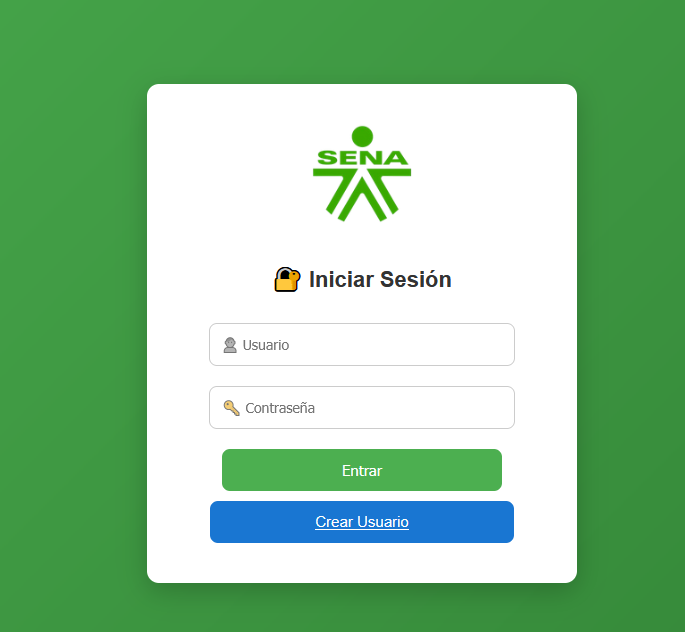
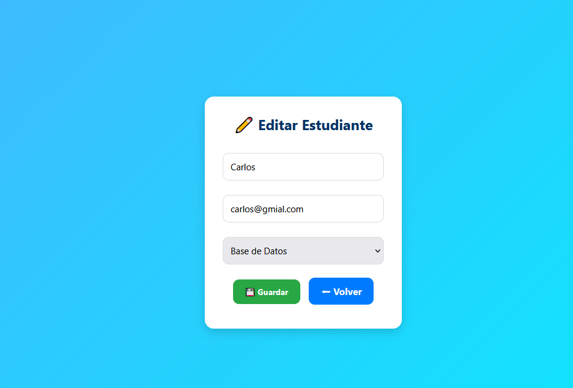

# Sistema de Gestión de Usuarios


**Evidencia:** GA3-220501093-AA3-EV02  
**Programa:** Análisis y Desarrollo de Software  
**Lenguajes y tecnologías:** PHP, MySQL, HTML, CSS, JavaScript  

---

## Descripción
Sistema de gestión de usuarios desarrollado en **PHP y MySQL** que permite:  
- Registro e inicio de sesión de usuarios.  
- Validación de datos de entrada.  
- Encriptación segura de contraseñas.  
- Actualización obligatoria de información del perfil (nombre, correo y contraseña).  
- Eliminación segura de cuentas.  

El proyecto sigue buenas prácticas de desarrollo y seguridad en el manejo de datos.  

---

## Funcionalidades principales
1. Registro seguro de nuevos usuarios.  
2. Inicio de sesión con control de acceso.  
3. Actualización de perfil obligatoria.  
4. Eliminación segura de cuentas de usuario.  
5. Gestión de errores y validaciones.  

---

## Instalación
1. Clonar el repositorio:  
```bash
git clone https://github.com/tu-usuario/nombre-del-proyecto.git
cd nombre-del-proyecto

<?php
$host = "localhost";
$user = "root";
$password = "";
$database = "sistema_usuarios";
?>

Abrir el proyecto en un servidor local (XAMPP, WAMP o similar).

Uso

Abrir index.php en tu navegador.

Registrarse como usuario.

Iniciar sesión con las credenciales creadas.

Actualizar tu perfil y/o eliminar la cuenta si lo deseas.

Comandos Git básicos
Clonar el repositorio

git clone https://github.com/tu-usuario/nombre-del-proyecto.git

git checkout -b nombre-de-la-rama

git add .

git commit -m "Descripción de los cambios"

git push origin nombre-de-la-rama

git pull origin main

git status


Integrantes del grupo de trabajo

Fabián Andrés Robledo Olave

Cindy Johana Cortes

Sebastián Álvarez Usma

Julián Simón Villa Florez

Ivan Danilo Zambrano Sarmiento

Juan Sebastián Rugeles Tafur

Sirley Duarte Florez

Andres Felipe Granda

Breiner Enrique Valdez Estevez

Edwin Ferley Garzon Bermejo

Juan Sebastian López

Castaño Luis Enrique Abello






